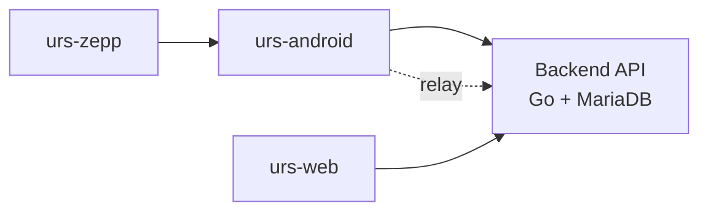

# urs

*User Resource Suite — or Utterly Random Stuff, depending on the day.*

A personal household-tracking app family — fuel, inventory, notes, chores,
shopping lists, beer log, work time, life map, vehicle service, and a
personal kanban board — built across a native Android app, a web
companion, a watch companion, and a self-hosted backend.

## Components

| Repo | What it is |
|---|---|
| [urs-android](https://github.com/mcfx-urs/urs-android) | Native Android app (Kotlin/Compose) — the primary, offline-capable client |
| [urs-web](https://github.com/mcfx-urs/urs-web) | Browser companion (React/TypeScript) for tasks awkward on a phone, home-network only |
| [urs-zepp](https://github.com/mcfx-urs/urs-zepp) | Zepp OS mini-app for Amazfit watches — quick logging actions from the wrist |
| [urs-backend](https://github.com/mcfx-urs/urs-backend) | Issue tracker for the backend — the Go/MariaDB REST API itself is self-hosted, not on GitHub |

## Architecture

All clients talk to one private REST API over a VPN tunnel; the Android
app also relays requests for the watch companion, which has no direct
network access of its own.

## Status

Personal project, actively developed.
